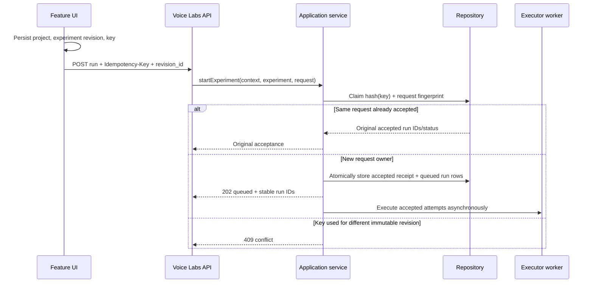

# Team 4 Voice Labs implementation journal

**Status at interruption:** implementation and review are intentionally halted. The current branch contains substantial local changes, plus a last-minute project-purge guard that has not yet been typechecked or tested. Do not treat this worktree as a final, approved release.

**Checkout:** `/Users/kartik/Desktop/personal/voice-labs-project-scoped-lab`  
**Branch:** `feat/project-scoped-lab`  
**Starting point:** `main` HEAD `1354a50`  
**Task source:** `/Users/kartik/Desktop/personal/Platform/local/handoffs/team-4-voice-labs.md`  
**Related task record:** `/Users/kartik/Desktop/personal/Platform/local/task-4-voice-labs.md`

This journal is a handoff document for the Team 4 Voice Labs work. No Team 1 implementation was changed during this follow-up. If “Team 1” in the latest request meant a different task, resolve that scope before presenting this document as its record.

## Executive state

The Voice Labs changes address run-start replay, shutdown draining, hosted JWT operation scopes, Voice Labs’ portion of project deletion, durable Earshot references, an embeddable feature package, real TVIC execution, bounded run/provider usage, and the local integration contract. Idempotency receipt retention itself is still unbounded. Most of the work was typechecked and exercised before the last project-purge race was discovered.

The last review found three unresolved concerns. A senior reviewer identified that the initial purge implementation only canceled work tracked in the current service process; idempotency receipts grew forever; and the feature package was configured as publicly publishable while the license and registry namespace were still unapproved. A regression test was added for cross-service purge during an active run. It failed as expected. Partial repository changes were then made to reject purge while a different worker has an active run or evidence lease. The user halted the coding task before those edits could be verified or debated again.

At the halt point:

- `pnpm typecheck`, `pnpm test`, `pnpm build`, and `pnpm pack:feature` had passed **before** the final purge guard edits.
- The full suite reported 56 passing tests and 9 skipped Postgres integration tests. `VOICE_LABS_TEST_DATABASE_URL` was not configured.
- A real Groq/Cartesia scripted-transcript TVIC smoke passed with a 1,341 ms executor duration and no failed smoke evaluators. An earlier run returned `failed` because 1,432 ms exceeded that smoke scenario’s 1,400 ms latency budget; the provider call itself returned trace and transcript data.
- The packaged feature tarball installed into a temporary isolated pnpm project from the local tarball in offline mode. Its component import and stylesheet were found successfully.
- A new active-run purge regression test was run red: the second service instance returned `local_data_deleted` instead of rejecting with 409. Partial code changes address this case, but no green run has yet been recorded.
- The licensed public release, registry publication, Platform-side JWT integration, Platform package pin, and Earshot project-wide delete/tombstone contract remain uncompleted or owned by other parties.
- No `git add`, `git commit`, or `git push` was run. No changes have been staged or published.

## User intent and persistent constraints

The user established these constraints across the task:

1. Work from the Team 4 handoff and understand the Voice Labs, TVIC, Earshot, and Platform ownership boundaries.
2. Create a fresh worktree from `main` and use an understandable community-facing branch name. The current worktree and branch above were created for this.
3. Keep code changes local. Never run `git add`, `git commit`, or `git push`.
4. Keep business logic in the application/domain layer and persistence mechanics in repository adapters.
5. Verify implementation. For live provider checks, use the actual TVIC environment rather than fabricated credentials; do not reveal, copy, or print secret values.
6. Request adversarial review from a senior developer/open-source advocate, iterate on valid findings, then request the latency-focused judge and red/blue review.
7. The latest user instruction supersedes the coding/review plan: halt the work and produce detailed documentation that lets another developer continue. The review loops were not completed for this follow-up.

The feature package’s product-owner-approved license and namespace decision were not supplied. Do not choose an SPDX license or publish the package on the user’s behalf. The current handoff describes the repo as source-available until that decision is made.

## Scope from the Team 4 handoff

The handoff at `Platform/local/handoffs/team-4-voice-labs.md` defines these work areas:

| Handoff item | Work performed | State at interruption |
|---|---|---|
| Durable run-start idempotency | Required an `Idempotency-Key`; fingerprinted the immutable experiment revision; stored accepted run IDs and queue status alongside queued run rows; made UI retry the same key after a lost response. | Implemented and tested in memory; Postgres restart test added but skipped without an explicit test DB. Senior reviewer found receipts are never pruned and need a defined retention/replay-after-expiry contract. |
| Graceful shutdown | Stop new run admission, wait 25 seconds, then abort accepted runs with an `AbortSignal`; persist cancelled/error state only after execution settles; wait for maintenance work before DB close. | Implemented. Unit shutdown and TVIC tests passed before the final unrelated purge edits. No signal-level Postgres deployment test was run. |
| Open-source legal status | Docs say source-available and do not add an arbitrary license. | Blocked on product-owner-approved license. This is deliberately not marked open source. |
| Separate feature release | Added an ESM `@voice-labs/feature` package scaffold and a reproducible build/pack path; tested local tarball install. | Local artifact works. It is not published or pinned by Platform. Senior reviewer noted `private:false` plus public `publishConfig` makes it publishable before approvals; this was not fixed before halt. |
| Project deletion | Added a Voice Labs-owned purge endpoint and idempotent receipt; retain links to Earshot incident IDs, endpoint, project mapping, and delivery status; abort current-process work before purge. | Partial. Same-process behavior and an ambiguous in-flight Earshot outcome are documented. Cross-replica worker coordination was challenged. A failing regression and partial active-work guard are present but unverified. Earshot itself still has no project purge/tombstone for absent incidents. |
| Hosted API auth | Verify Platform-signed JWT and exact audience/issuer, expiration, subject, project ID, short lifetime, token ID, and operation scope; derive project context only from token. | Implemented and tested with local JWKS test keys. Platform’s summary adapter still needs to issue the scoped token. |
| Standalone and honest behavior | Preserve loopback local mode, deterministic simulation labels, explicit provider failure/cancellation/evaluation states, explicit latency scope, and no Platform identity claims in TVIC. | Implemented/documented and unit-tested before latest purge edits. |

## Architecture and important data flows

### Cross-service ownership and business flow

The intended hosted flow crosses four codebases, but each service keeps its own rules and records:

| System | Owns | Receives / returns in this flow |
|---|---|---|
| Platform | Customer session, membership and project selection, product shell, and cross-service deletion orchestration. | Mints a short-lived signed token for a selected project, mounts the Voice Labs feature, and later coordinates deletion by calling each data owner. Platform-side JWT and package wiring were not changed in this work. |
| Voice Labs | Scenario/experiment definitions and revisions, run acceptance and state, evaluations, provider usage limits, Voice Labs persistence, and links to evidence. | Verifies the Platform token at its HTTP boundary; accepts a revision-pinned run; calls the executor port; stores results and evaluation state; optionally sends a privacy-limited metadata bundle to Earshot. It returns Earshot references as deletion evidence rather than claiming to delete Earshot data. |
| TVIC | Voice-agent runtime/session execution and its provider integrations. | Is invoked by the Voice Labs executor with candidate instructions, runtime settings, and a cooperative cancellation signal. It returns run artifacts/events. It receives no Platform JWT or customer authorization policy. The current path creates an agent from Voice Labs inputs; it does not demonstrate reuse of Platform's saved managed-agent identity/configuration. |
| Earshot | Its own incident/evidence records and incident deletion behavior. | Receives a metadata-only incident with project mapping and an authenticated service credential in a request header. Its current API has individual incident deletion, not an atomic project purge or tombstone for an ID that has not arrived yet. |

```mermaid
sequenceDiagram
    participant U as User / Platform UI
    participant P as Platform backend
    participant V as Voice Labs API
    participant DB as Voice Labs repository
    participant T as TVIC runtime/providers
    participant E as Earshot API
    U->>P: Select project and open Voice Labs feature
    P->>V: Feature request with short-lived project-scoped JWT
    U->>V: Start run with immutable revision IDs and Idempotency-Key
    V->>V: Verify token, route scope, and project context
    V->>DB: Atomically persist acceptance receipt and queued run rows
    V-->>U: Stable accepted run IDs
    V->>T: Execute pinned inputs with cancellation signal
    T-->>V: Provider/runtime artifact and trace metadata
    V->>V: Evaluate results and persist terminal run/evaluation state
    opt Evidence capture requested
        V->>DB: Persist attempted Earshot reference
        V->>E: Send metadata-only incident
        E-->>V: Return/confirm incident reference
        V->>DB: Mark reference attached
    end
    U->>V: Read runs, evaluations, and evidence links
    Note over P,E: For project deletion, Platform coordinates owners; Voice Labs returns its own deletion receipt and Earshot IDs. Earshot deletion must be confirmed separately.
```

The diagram describes the implemented boundaries, with two qualifications: the Platform JWT minting and feature mount remain cross-owner tasks, and project erasure is not complete while Earshot cannot fence a delayed ingest. In local development, a JSON repository and deterministic runner can be used; hosted multi-worker operation requires the Postgres-backed adapter and a real executor configuration. The JSON adapter is not a distributed coordination mechanism.

### Run-start idempotency



The key itself is hashed before storage. The request fingerprint includes project ID, experiment logical ID, and immutable experiment revision ID. Run IDs are generated once and persisted with the accepted receipt. The UI stores the key before sending so a browser reload can replay the same request. The unresolved reviewer question is retention: the current receipt table has no aging policy, and the UI pending record has no expiry rule. Do not add a server retention window without also documenting how old pending browser requests behave.

### Shutdown and execution cancellation

On SIGTERM or SIGINT, `main.ts` calls `stopAcceptingRunStarts()`, stops timers, closes HTTP admission, lets active work settle for 25 seconds, aborts remaining run controllers, waits for tracked work/maintenance, then closes Postgres. The executor interface carries an optional `AbortSignal`; the TVIC runner forwards it to `agent.start`, cancellation waiters, and stop cleanup. Queued cells after an abort are persisted as cancelled. If TVIC cleanup cannot be confirmed, Voice Labs persists an explicit error with code `cancellation_unconfirmed` rather than claiming confirmed cancellation.

TVIC is cooperative. The reviewer notes that its own stop/cleanup deadlines are bounded and a provider that ignores cancellation cannot be forcibly killed. The normal shutdown path waits for actual service promises, but a process crash still relies on stale-run recovery.

### Earshot evidence lifecycle and deletion boundary

The Earshot sink sends a metadata-only incident. It keeps a deterministic incident ID based on the Voice Labs run ID, sends the mapped Earshot project ID in the project assertion header, and includes the mapped API key only in the request header. It excludes transcripts, audio, tool arguments, model text, identity, diagnostics, and raw OTLP. Before sending, Voice Labs records an `attempted` reference; after a verified Earshot response it updates the durable ledger to `attached`.

The durable per-project reference ledger survives run deletion and run retention. A project purge receipt merges this ledger with evidence references still present on run rows and emits a sorted, deduplicated list. It contains no API credential. `deliveryStatus: attempted` means a POST may have committed even when Voice Labs did not receive its response.

Ownership is split by service: Voice Labs deletes its own records and returns Earshot IDs; Platform coordinates deletion across services; Earshot owns incident deletion. Earshot currently supports individual incident DELETEs, not a project-wide deletion endpoint. Its 404 for a missing incident does not create a tombstone, so a delayed ingest can arrive after Platform receives 404. Whole-project erasure must remain partial until Earshot supplies an ingest fence/tombstone or equivalent delivery settlement contract.

### Hosted authentication

The JWT verifier accepts RS256/ES256 tokens from the configured remote JWKS, configured issuer, exact `voice-labs` audience, and requires `exp`, `iat`, `sub`, `project_id`, `scope`, and `jti`. Tokens must be no more than five minutes between `iat` and `exp`; `maxTokenAge` is five minutes with 30 seconds clock tolerance. Requests use project identity from the verified token, and the summary route additionally requires its route project and `X-Platform-Project-Id` to match.

Route scopes are `voice-labs:read`, `voice-labs:write`, and `voice-labs:project:delete`. Only loopback local mode can use the optional static service token on the summary route. `ProjectContext` sent to the TVIC runner contains only user/project IDs established by the API boundary; TVIC receives no JWT or Platform authorization rule.

The Voice Labs route contract is implemented in this repository. Platform still needs to stop sending `VOICE_LABS_SERVICE_TOKEN` for the hosted summary route and mint the short-lived project-scoped JWT described by `docs/platform-integration.md` and the canonical Platform contract.

## File-by-file change inventory

This table records every tracked changed file shown by `git diff --name-status`, and the principal new source/test/documentation files present at interruption. Many of the implementation files contain work from the original Task 4 implementation as well as this follow-up; the row names the durable responsibilities, not every line-level refactor.

### Root configuration, dependency graph, and docs

| File | Change and rationale |
|---|---|
| `.env.example` | Replaced machine-specific TVIC/Earshot paths with configurable relative defaults. Added explicit local/JWT auth, local JSON/hosted Postgres selection, CORS allowlist, run retention, TVIC opt-in/environment loading, audio fixture root, and Earshot mapping examples. Kept real credentials absent. |
| `README.md` | Documents source-available status, local/hosted setup, JWT claims/scopes, run-start idempotency, shutdown cancellation, provider limits and measurement semantics, retention, metadata-only evidence, purge receipt/partial cross-service behavior, and feature package. |
| `package.json` | Removed the `file:../TVIC` runtime dependency and pinned published `voice-runtime@1.2.0`; added `jose`/`pg`, React peers and dev dependencies, feature exports, and `build:feature`/`pack:feature` scripts. The package itself remains `private:true`. |
| `pnpm-lock.yaml` | Regenerated after package/dependency/workspace changes so the lock resolves the published TVIC runtime and new auth/storage dependencies. |
| `pnpm-workspace.yaml` | Added the feature package to the pnpm workspace/build configuration and the `voice-runtime@1.2.0` minimum-release-age exclusion used by the lock setup. |
| `tsconfig.json` | Excluded the feature declaration staging output from ordinary app TypeScript compilation so app and package builds have separate type outputs. |
| `docs/platform-integration.md` | Added the API route/auth contract, feature usage/host token/CSS contract, run lifecycle and latency definitions, Earshot metadata mapping and deletion limitations, and current cross-repository blockers. |
| `packages/feature/README.md` | Describes the embeddable component, peer dependency expectation, local build/pack command, and pending legal/namespace approval. |
| `packages/feature/package.json` | Defines the ESM package name/version, exports, files, React peers, stylesheet side effect, and public publish configuration. The `private:false`/public configuration is a reviewer finding and must be disabled pending approval. |
| `scripts/copy-feature-styles.mjs` | Copies the feature-scoped stylesheet into the bundle staging directory. |
| `scripts/prepare-feature-package.mjs` | Copies the built JS, declaration tree, CSS, manifest/README inputs to `packages/feature/dist` for packing. |
| `vite.feature.config.ts` | Builds the embeddable component separately from the standalone app and leaves React as an external peer. |
| `tsconfig.feature.json` | Emits package-facing declarations into a separate feature type tree. |

### Domain and execution ports

| File | Change and rationale |
|---|---|
| `src/domain/model.ts` | Added/expanded project context, run states, immutable experiment revision references, queued/start acceptance records, provider/evidence metadata, Earshot reference ledger entries, and project purge receipt types. These are data contracts, not storage behavior. |
| `src/domain/ports.ts` | Defines the app-facing executor/evidence ports and optional cancellation signals. Keeping these interfaces independent of HTTP/JWT lets service logic request work without sending auth policy to TVIC. |
| `src/domain/limits.ts` | Centralizes caps for run cells, provider turns, deployment concurrency, rolling attempts, catalog size, evidence retry/backlog, leases, run-start preparation, and shutdown grace. |
| `src/domain/compare.ts` | Updates comparison summaries/provider labels to distinguish deterministic simulations from actual provider trace data and uses the new run/evaluation states. |
| `src/domain/evaluate.ts` | Preserves distinct passed/failed/unknown evaluator outcomes and computes latency against the declared executor wall-clock metric. |
| `src/domain/domain.test.ts` | Adds direct coverage for domain behavior changed in comparison/evaluation. |

### Persistence and infrastructure adapters

| File | Change and rationale |
|---|---|
| `src/adapters/repository.ts` | Defines the project-scoped repository port, run queries, durable start-request claims, evidence references, purge receipts, and shared catalog-capacity/purge-quiescence errors/helpers. Application rules call this port; adapters perform storage operations. |
| `src/adapters/memory-repository.ts` | Implements project-scoped state, run status transitions, idempotency receipts, provider usage/slots, evidence retry leases, Earshot reference ledger, and local purge behavior. It is the fast unit-test adapter. The latest patch checks active leases before purge and rejects lock acquisition after purge. |
| `src/adapters/json-repository.ts` | Keeps local single-project persistence, upgrades legacy JSON state, serializes file mutations, and implements the new idempotency/evidence/reference/purge records. The latest patch puts run lock, provider slot, evidence claim, and JSON state changes through a common queue and checks for active run/evidence leases before purge. This latest queue/purge work is unverified. |
| `src/adapters/postgres-repository.ts` | Adds migrations/tables/indexes for project catalogs/runs, idempotency, usage, leases, Earshot references, purge receipts, and project write fences; implements project-scoped reads/writes, atomic receipt+queued-run acceptance, bounded cleanup, and terminal-state update protection. The latest patch adds project run locks to write-fence triggers and checks active run/evidence leases and queued/running records before purge; it throws `ProjectPurgeBlockedError` and is unverified. |
| `src/adapters/postgres-repository.test.ts` | Adds DB-backed restart/idempotency/purge/lease/provider-limit/catalog integration scenarios. They are skipped unless `VOICE_LABS_TEST_DATABASE_URL` is explicitly supplied. The latest test adds a purge rejection scenario for a second worker’s active run/evidence lease and has not been run against Postgres. |
| `src/adapters/seed.ts` | Adds the fields and project/user ownership needed to seed current state contracts for local mode and tests. |
| `src/adapters/deterministic-runner.ts` | Updates deterministic artifacts to satisfy the new `RunRequest`/`RunArtifact` shapes and explicitly maintain simulation labeling/statuses. |
| `src/adapters/tvic-runner.ts` | Uses the published TVIC API, preflights provider/audio setup, runs transcript/audio modes, bounds/records public runtime event kinds, redacts provider secrets from error strings, and propagates AbortSignal through setup/agent start/call/stop so shutdown cancellation can settle. |
| `src/adapters/tvic-runner.test.ts` | Updates tests to the new runner signature and checks opt-in provider configuration/cancellation/failure handling without adding fabricated API credentials. |
| `src/adapters/earshot-evidence-sink.ts` | Implements an authenticated metadata-only Earshot API client, unique Platform→Earshot project mapping, endpoint normalization/HTTPS requirement, deterministic bundle IDs, response-reference verification, abort support, and durable attempted/attached reference metadata. |
| `src/adapters/earshot-evidence-sink.test.ts` | Covers endpoint normalization, project mapping, privacy omissions, idempotent IDs, malformed response handling, and cancellation/error behavior. |
| `src/adapters/audio-fixtures.test.ts` | Covers fixture validation and project-root/path traversal restrictions for audio runs. |

### Application service and HTTP boundary

| File | Change and rationale |
|---|---|
| `src/application/service.ts` | Orchestrates project-scoped catalog revisions, quotas, pinned experiment inputs, run acceptance/execution, service-scoped cancellation/draining, stale recovery, evaluation, provider slot leases, metadata retry/outbox, Earshot reference recording, purge receipts, and project/run guards. Persistence operations go through `LabRepository`; the service does not issue SQL. The latest patch converts `ProjectPurgeBlockedError` to retryable HTTP 409 but is not verified. |
| `src/application/service.test.ts` | Covers idempotency replay/conflict, stale-run terminal protection, drain cancellation, evidence retries, quota/limits, project isolation, immutable revisions, and purge receipt behavior. A final new cross-service active-run purge test was deliberately run red. |
| `src/server/auth.ts` | Creates local loopback auth or hosted JWT verification via remote JWKS, issuer/audience/algorithm/required claims checks, token lifetime and scope parsing, and project-context derivation. |
| `src/server/auth.test.ts` | Uses ephemeral test keys and a local JWKS server to exercise valid/missing/expired/wrong audience/scope/project/auth-mode cases. No production keys are used. |
| `src/server/http.ts` | Routes API requests through required scope checks, project identity checks, JSON validation/body limits, idempotency headers, the project purge route, the bounded Platform summary route, CORS allowlists, and safe HTTP error mapping. Static app hosting stays separate. |
| `src/server/http.test.ts` | Covers JWT-protected route behavior, project mismatch, scope gating, run-start required key/replay, and purge response/mismatch/replay. |
| `src/server/schemas.ts` | Adds/revises validation schemas for immutable revision IDs, project-owned catalog inputs, audio fixture paths, provider run settings, and run-start requests. |
| `src/server/main.ts` | Wires local or Postgres repositories, auth mode, TVIC environment loading, Earshot sink, bounded maintenance, retention/recovery timers, and signal-based admission stop/drain/cleanup before Postgres closes. |
| `src/cli.ts` | Adapts CLI operations to explicit project/user context and new repository/service signatures while retaining local deterministic workflows. |

### UI and package embedding

| File | Change and rationale |
|---|---|
| `src/web/App.tsx` | Adds project-scoped API requests, auth token support for embedding, run-start key persistence/replay, revision-pinned runs/history, explicit run/evaluation/cancellation/error/evidence states, latency explanations, deep-link support, and standalone/embedded modes. The pending-key persistence does not yet have an expiry policy corresponding to server receipt retention; no server receipt retention has been implemented either. |
| `src/web/styles.css` | Applies small standalone-app integration/style updates while the feature stylesheet is separately scoped. |
| `src/web/feature.ts` | Exposes the host-ready React feature component and type contract without private Platform imports. |
| `src/web/styles.feature.css` | Scopes embeddable UI selectors below `.voice-labs-feature` and provides host design-token fallbacks. |

### Purge changes as of the original pause — superseded below

At the time of the original pause, the following changes were unverified. The
dated User-directed continuation at the end of this journal records later
verification and supersedes that status.

After the red test failed, work began to prevent a purge from deleting project data while another repository worker still held an active run or evidence retry lease:

1. `src/adapters/repository.ts` gained `ProjectPurgeBlockedError` and `assertProjectPurgeQuiescent`, which rejects if a run lock, active evidence lease, or queued/running row exists.
2. Memory and JSON repository purge paths call that helper. Lock acquisition after a completed purge returns 410. JSON run-lock/provider-slot/evidence-claim mutations now share a local queue with JSON writes so their order with purge is serialized.
3. Postgres purge marks the project write fence inside its transaction, checks live run lock, run status, and evidence retry lease, then rolls back with `ProjectPurgeBlockedError` if work remains. The project run-lock table is added to the generic write-fence trigger set so new locks cannot race a committed purge.
4. `src/application/service.ts` maps the repository conflict to HTTP 409 and tells the caller to retry after other worker activity settles.
5. Unit and Postgres regression coverage was added.

This is a **fail-closed guard**, not distributed cancellation. It waits for callers to retry after remote activity naturally settles. The reviewer’s requested bar was durable cross-replica coordination that prevents dispatch and waits for active workers to settle or acknowledge cancellation before returning a deletion receipt. An implementing developer must decide whether a 409/retry protocol satisfies the product contract; if deletion must cancel remote work immediately, add a durable deletion-request/cancellation mechanism and two-worker DB integration tests. Do not overstate this patch as verified or as distributed cancellation.

## Review participants and findings

Existing agents were reused; no new agents were spawned in this follow-up.

| Agent | Role / state | Findings relevant to continuation |
|---|---|---|
| `/root/earshot_review` | Cross-service Earshot contract review; completed. | Earshot’s current API deletes one incident per request. Known incident deletion is idempotent; unknown incident gives 404 without tombstone. No project-wide delete endpoint. Cross-service deletion must be coordinated by Platform and remain partial while delayed ingest is possible. Also flagged Earshot’s project scope is not advertised as a hostile SaaS tenant boundary. |
| `/root/tvic_review` | TVIC runtime/cancellation review; completed. | TVIC supports AbortSignal and `agent.stop()` cooperatively, but has bounded cleanup and cannot force-kill a provider. Persist terminal state only after confirmed cleanup; preserve explicit error when cancellation is unconfirmed. Terminal-state protection is needed so late worker results cannot overwrite stale recovery. |
| `/root/voice_labs_review` | Voice Labs ownership/data lifecycle review; completed. | Store durable Earshot refs outside run records so retention/run deletion cannot erase Platform’s deletion IDs. Preserve hashed idempotency receipts until project purge or define equivalent replay window. Account for delayed ingests because Earshot 404 does not tombstone absent IDs. |
| `/root/senior_open_source_review` | Senior developer/open-source debate persona; completed for the current code state before the last patch. | P1: service-local controllers do not stop work on another replica, purge may free a provider slot while an old call runs. P2: accepted run-start receipts grow without bound and can replay IDs for pruned runs. P2: feature manifest is publicly publishable without approved license/namespace. Reviewer said auth scope enforcement and shutdown drain looked sound. Reviewer did not edit files or run tests. |
| `/root/latency_judge` | Distinguished latency judge; no current follow-up review is recorded. | The older `Platform/local/task-4-voice-labs.md` progress note reports a 99/100 static score for the earlier Task 4 implementation and explicitly says that was not a measured 250 ms benchmark. That score is not an approval of this follow-up diff. |

The requested post-implementation senior debate loop, subsequent judge loop, and final red/blue team pass have **not** been completed for this follow-up. The user explicitly halted them to request documentation. Do not present them as complete.

## Verification ledger

These are the recorded commands/results, in time order. The final three purge-related source/test edits happened after the successful checks listed below.

| Command/action | Result | Qualification |
|---|---|---|
| `pnpm typecheck` | Passed. | Before the latest purge guard changes. |
| Focused `vitest` set for service, HTTP, auth, Earshot sink, TVIC runner, domain | 6 files, 53 tests passed. | Before the latest purge guard changes. |
| `pnpm test` | 7 files passed; 56 passed, 9 skipped. | Skipped tests were Postgres integration tests because `VOICE_LABS_TEST_DATABASE_URL` was not configured. Before latest purge guard changes. |
| `pnpm build` | Passed; Vite emitted standalone web bundle. | Before latest purge guard changes. |
| `pnpm pack:feature` | Passed; generated `/Users/kartik/Desktop/personal/voice-labs-project-scoped-lab/artifacts/voice-labs-feature-0.1.0.tgz`. | Packaged contents included entry JS, CSS, `README.md`, package manifest, and declaration files. `artifacts/` is ignored/generated local output, not a publish. |
| Tarball content inspection | Passed. | Entry bundle imports React only; no private Platform module import was found in the packaged entry. |
| Isolated local package install | Passed. | `pnpm add --offline <tarball> react@19.3.0 react-dom@19.3.0` in a temporary project; importing `@voice-labs/feature` and locating its stylesheet succeeded. This proves local tarball install, not public registry installation. |
| TVIC environment availability check | Passed without exposing secret values. | `TVIC/.env` existed and Groq, Cartesia API key/voice ID, and Deepgram variable presence were logged as booleans only. |
| First real TVIC smoke | Provider-backed artifacts returned, final status `failed`. | Groq/Cartesia trace, two transcript turns, call ID present; duration 1,432 ms exceeded the fixture’s 1,400 ms latency budget. The output did not include transcript content or secrets. |
| Second real TVIC smoke | Passed. | Actual Groq/Cartesia, scripted transcript mode, final status `passed`, 1,341 ms, two transcript turns, call ID present, zero failed smoke evaluators. It used a transport smoke with no business tools, no content expectations, and a 60,000 ms latency budget. No transcript or credential values were emitted. |
| New test `does not purge project data while another worker owns an active run` | Failed as expected (red). | It expected service instance B to receive 409 while service instance A held a run; current repository instead returned a `local_data_deleted` receipt. This was the evidence prompting the latest partial code fix. |
| `git diff --check` | Passed at the last status inspection. | Does not validate TypeScript/behavior of the final partial patch. |

## Open decisions and cross-owner blockers at the original pause

These statuses describe the earlier halted session. The dated User-directed
continuation below supersedes implementation and verification statuses where
it records later work; product decisions and external acceptance blockers
remain in force unless expressly resolved.

### Product decision ownership

Product and policy choices are deferred until later by the user and are not needed to continue the current technical work. Do not pause implementation or technical review to resolve them, and do not invent an approval. Continue from the existing written behavior and record any temporary assumptions. This applies especially to purge outcomes and user messaging, Earshot deletion guarantees, idempotency receipt lifetime and replay behavior, data retention/privacy, usage limits, Platform auth/replay policy, package name/license/release path, managed-agent and tool expectations, audio acceptance, evaluator requirements, and the definition of any latency target.

Technical facts that can be established from existing code or contracts (such as the configured JWT issuer/audience or current audio validation) should be inspected directly. Approval-dependent actions such as adding a license or publishing a package remain deferred until the user makes those decisions. Do not place credentials in chat or documentation; configure test secrets through the designated local environment.

1. **License:** Product owner must select/approve an OSI-approved license before adding a root `LICENSE` file or advertising the repo as open source.
2. **Package publish gate:** Disable publishing until license and registry namespace are approved. Then prove a clean registry install and make Platform pin the exact release in its lockfile.
3. **Receipt retention:** Pick an explicit idempotency receipt expiry policy, implement bounded cleanup, define replay behavior after expiry, and update UI handling for an old unresolved localStorage key. Preserve the no-double-start guarantee for the documented window.
4. **Distributed purge:** Decide between fail-closed 409/retry when another worker is active and an immediate cross-replica cancellation protocol. The current partial guard has not been tested; reviewer wants durable coordination and DB-backed two-worker run/evidence tests.
5. **Earshot deletion:** Earshot must add an ingestion fence/tombstone or Platform must keep the deletion state partial until no late ingest can appear. Platform remains the cross-service coordinator.
6. **Platform JWT:** Platform must mint the project-scoped short-lived token expected by Voice Labs. Current hosted summary code was reported to send the static service token; no Platform source was edited here.
7. **Platform feature consumption:** Platform must mount the feature and pin the published artifact only after release prerequisites. The local file package/tarball work does not modify Platform’s package manifest or lockfile.
8. **Managed TVIC agent acceptance:** Existing Task 4 docs say the current executor creates a TVIC agent from Voice Labs candidate instructions and process settings; it does not reuse Platform’s saved managed-agent ID/configuration. Tasks 1/2 need a trusted shared-agent execution contract for the “same managed agent as browser call” criterion.
9. **Database verification:** Supply an explicit non-production `VOICE_LABS_TEST_DATABASE_URL` to run all Postgres integration tests, including the new active-work purge case and restart/idempotency/write-fence coverage. Never run schema-destructive tests against a production Platform DB.
10. **Latency claim:** The 1,341 ms smoke is one observed executor duration, not a 250 ms request SLO/percentile. No benchmark or latency judge pass exists for this follow-up.

## Next actions for the developer who resumes

1. Read this journal, `docs/team-4-voice-labs-discussion-log.md`, `docs/platform-integration.md`, the Team 4 handoff, the canonical hosted integration contract, and the latest reviewer finding in this document.
2. Inspect `git status --short --branch` and the current diff before editing. All changes are local and unstaged; preserve the no-add/commit/push constraint.
3. Finish the partial JSON/memory/Postgres purge guard, verify no table/lock path permits a successful purge while a remote provider execution or evidence delivery is live, and decide whether 409/retry meets the contract. If it does not, implement durable cross-replica cancellation coordination.
4. Add/keep tests first for each behavior; rerun the new red regression and ensure it turns green. Add the Postgres two-worker active provider and active Earshot post tests. Use only a designated non-production test DB.
5. Define/implement idempotency receipt retention and stale browser pending-key handling; add tests for expired versus live keys and update both contract docs.
6. Set the feature manifest unpublishable until legal/namespace approval; do not add license metadata by guesswork.
7. Run typecheck, all unit tests, Postgres integration tests if test DB is available, root build, feature build/pack, isolated package install, and `git diff --check` again after the final edits.
8. Re-run the senior debate against the actual final diff; address valid findings and invite a follow-up concurrence. Then request the latency judge and red/blue user-impact/security pass. Record exact reviewer outputs and do not infer a “98%” or 250 ms result.
9. Update `Platform/local/handoffs/team-4-voice-labs.md` and `Platform/local/task-4-voice-labs.md` with final verified state and cross-owner blockers. Keep provider keys/transcripts out of documentation.
10. Stop before licensing, publishing, Platform pinning, or Git staging/commit/push until the relevant approval/owner authorization is clear.

## Git and data hygiene at the halt

The checked out branch was `feat/project-scoped-lab`. `git status` showed modifications and untracked local work under this worktree. Nothing was staged or committed. No `git add`, `git commit`, or `git push` was run. The live provider environment was loaded in process from the existing TVIC `.env`; no credentials were copied into the Voice Labs checkout or printed. Temporary consumer install files were written under the system temporary directory; the local feature tarball is under ignored `artifacts/`.

## User-directed continuation — 2026-09-30

The user resumed Task 4 with Team 4 Voice Labs and only its required Platform
integration in scope. The current scope, confirmed policy boundaries, source
changes, tests, and remaining acceptance are recorded in
[`Platform/local/task-4-voice-labs.md`](../../Platform/local/task-4-voice-labs.md).
That record supersedes the pause-time “next actions” above where they conflict;
the earlier history and product choices remain preserved.

The active-run purge regression now passes. The repository-level Postgres tests
verify rejection while a different worker holds a run lock or evidence lease.
The feature manifest is private and has no public `publishConfig`. Platform
consumes the local feature package through a `file:` dependency and mounts it at
`/lab`; its authenticated BFF derives the project from Platform's session,
allowlists feature operations, and mints short-lived read/write project tokens.
The BFF deliberately excludes project purge while the accepted Earshot deletion
contract and Platform coordinator remain open.

Verification after resuming: Voice Labs has 70 passing tests using a disposable
loopback Postgres database; typecheck, app build, and feature build pass.
Platform has 43 passing tests with its Postgres integration test enabled,
including a focused contract test for the server-owned Lab summary's scoped
JWT; typecheck, lint, and production build pass. A real TVIC scripted LLM/TTS
smoke passed in 1,947 ms without STT or business tools. A real audio-mode retry passed in
7,990 ms with STT/LLM/TTS and no business tools; the first audio attempt ended
in `voice_runtime.remote_hangup`. No transcript or credential values were
printed. These timings do not define or prove a latency SLO.

### Follow-up regression fixes — 2026-09-30

A senior review of the resumed implementation found three concrete gaps: the
reference ledger did not migrate legacy evidence or retain a destination when
configuration changed; deleting a run could race a project purge; and the Lab
UI discarded the BFF's human-readable error message. The follow-up fixes are
implemented and covered by regression tests:

- A versioned Postgres migration converts the reference key to
  `(project_id, incident_id, endpoint)` and backfills every still-surviving
  run payload. Memory and JSON repositories use the same incident-plus-endpoint
  identity and preserve references through run deletion and retention pruning.
- Deleting a run now takes the project's write fence and records its evidence
  reference in the same transaction before removing the row. The Postgres
  trigger migration scopes its existence check to the target relation, which
  was necessary for isolated-schema test runs.
- The Platform error `message` is now shown in Voice Labs, bounded to 500
  characters, with a stable fallback for non-JSON responses.
- Regression coverage includes legacy JSON/Postgres upgrades, duplicate
  incident IDs at different endpoints, preservation after run deletion, and
  actionable BFF error display.

The migration can only recover references present in run payloads at migration
time. Any reference erased by a run deletion before this ledger existed cannot
be reconstructed from Voice Labs storage. Cross-service deletion therefore
remains partial pending owner reconciliation and an accepted Earshot contract.

The senior re-review also identified a deployment constraint: the migration
changes the reference table primary key, while an older binary still upserts
against the old key. Drain all old Voice Labs instances before starting this
migration. Supporting a mixed-version rolling deployment would need an
expand/contract migration and an intermediate compatible release.

After these fixes, the isolated Postgres Voice Labs suite passed 77/77 tests,
including 12 Postgres repository tests; typecheck, app build, feature build,
and private feature packing passed. Platform passed 43/43 tests with its
Postgres integration enabled, typecheck, lint, and production build.
The Task 4-specific senior re-review is complete and concurs with the bounded
local implementation, subject to the documented drain-before-migration
requirement. The separate judge and red/blue review remain pending; the current
Platform task log tracks them. These results do not
establish same-user/project staging acceptance or a latency SLO. Keep overall
deletion partial until Earshot accepts/releases its API and confirms linked
records are deleted.

### Cleanup uncertainty and Earshot transport hardening — 2026-09-30

The next senior review found that a failed marker write followed by a worker
restart could lose cleanup uncertainty when stale recovery changed the run to
`run_abandoned`; it also found that a non-success Earshot response could leave
its body unread after the request deadline was cleared. Both paths are now
fail-closed:

- Stale started TVIC/audio rows become durable `cancellation_unconfirmed`
  markers. Before recovery, project admission rejects such rows after the
  worker lease expires, and provider capacity counts them when neither a live
  project lease nor provider slot exists. Stale recovery preserves the marker.
  The Postgres partial index covers cleanup markers and started provider rows.
- The marker blocks same-project starts, run deletion, retention, and purge.
  Voice Labs has no automated reconciliation path, so its 409 messages no
  longer imply a normal retry can clear the marker. Product deletion remains
  partial pending Earshot acceptance and confirmation.
- Earshot response bodies are limited to 16 KiB. The timeout and caller abort
  remain active through response parsing; non-success response bodies are
  canceled before the request returns an error. Tests cover stalled success
  bodies, caller cancellation, size limits, redirects, and non-success bodies.
- Stale-row regressions cover process restart, same-project lock acquisition,
  and global provider capacity in both the memory service path and Postgres.

The latest Voice Labs run passed **92/92 tests** with all 13 Postgres
repository tests enabled against the designated disposable local database.
That suite preceded the final UI-only wording refinements. `pnpm typecheck`
passed before those refinements; `pnpm build` (including `tsc --noEmit`) and
`pnpm build:feature` passed after the final UI copy and stylesheet changes.
Platform source was not edited during this continuation; its prior
43/43 tests and typecheck/lint/build remain its latest checks. Real TVIC
provider smokes were rerun after the cleanup and transport hardening: scripted
LLM/TTS passed in 1,492 ms, and generated synthetic speech passed through
Deepgram STT/LLM/TTS in audio mode in 7,226 ms. They used no business tools and
printed no transcript or credential values. These are executor wall-clock
observations, not an SLO. They preceded the final UI-only copy changes.

The senior developer review concurs with the implementation and final UI copy.
The judge's exact-tree reassessment passed at 99/100. Red/blue review found
that the run
detail view offered deletion for an unresolved TVIC cleanup marker and that
experiment setup blurred Voice Labs retention with Earshot's metadata-only
capture. The UI now disables deletion for that marker and states Voice Labs'
current configurable 30-day retention default separately from Earshot capture,
including the active/pending/uncertain cases that can outlive that window. It
also clarifies that Earshot delivery is attempted only when capture and a
destination are configured, and may fail or remain unconfirmed. Run deletion
copy discloses the minimal Voice Labs reference kept after an Earshot delivery
attempt and says Earshot controls retention of any incident it accepted.
The final red/blue review passed with no remaining local user-flow or security
finding. The review also identified a hosted multi-tenant operational gate: an alert, named owner,
and owner-approved recovery procedure are needed for markers that can hold
provider capacity indefinitely. No automatic marker clearing was added. No
public package was published or pinned; no Git command was run.

### Status-poll optimization follow-up — 2026-10-05

The user identified that run detail polling hydrated the latest experiment,
scenario, and candidate catalog just to check the purge state, then separately
loaded the full run. Auditing all UI timers also found that the experiment page
reloaded up to 50 complete run artifacts and the full project bootstrap every
1.5 seconds while any run remained active.

Both polling paths now use narrow repository projections:

- Single-run detail reads use one keyed Postgres query joining the run row to
  the project write-fence existence check. The service does not read catalog
  state for this lookup. The progress route returns status and only the
  evidence fields displayed by the run screen; terminal artifacts are fetched
  once when an active run becomes terminal.
- Experiment detail reads use one bounded query for the latest 50 IDs/statuses
  in the exact experiment revision, aggregating those two fields only. The
  project fence is represented as a boolean so a growing Earshot reference
  receipt is never serialized on a poll. Full experiment detail is reloaded
  only when a new run ID appears. Complete run artifacts are fetched for
  terminal status transitions, and a newly discovered active run outside the
  recent detail page is fetched once so the UI can display it. The browser does
  not refresh bootstrap on each tick; returning to overview performs the normal
  refresh.
- Platform's feature proxy permits only this GET route and forwards its pinned
  `revision_id` and bounded repeated `run_id` values. Other run payload routes
  remain outside the allowlist.

Red/green regression coverage verifies that service polling avoids catalog
reads; Postgres issues one bounded query without selecting full run payloads or
purge receipt JSON; the result excludes transcript, tool, incident, digest,
and retry-accounting data; and Voice Labs returns 410 after project purge.
The HTTP route and Platform BFF query forwarding are covered.

Verification after this change: Voice Labs passed 100/100 tests with all 13
Postgres repository tests against a fresh disposable loopback database,
`pnpm typecheck`, `pnpm build`, and `pnpm build:feature`. Platform passed
90/90 tests with its Postgres integration enabled, `pnpm typecheck`, `pnpm
lint`, and `pnpm build`. The temporary Postgres container was stopped after
verification. No TVIC execution code changed, so real-provider smokes were not
rerun. These checks and the preceding provider observations are not a latency
SLO; no 250 ms target has been set or measured. Earshot deletion remains
unaccepted and whole-project deletion stays partial.

The exact-tree senior/open-source review, judge assessment, and final red/blue
review for this follow-up remain outstanding until recorded below. No Git
command was run; all changes remain local.

### Zero-visible-active reconciliation and final review preparation — 2026-10-05

The senior review caught that experiment polling still returned early when
the currently displayed recent page had no active rows. That condition would
hide an active run outside the 50-row page, despite the repository query
returning such a row. The earlier status note saying the page performs an
initial reconciliation was premature; the gate had not actually been removed.

The effect now builds its request through the production
`buildExperimentRunStatusUrl` helper and performs one check on experiment
entry even when no displayed row is active. It continues at the existing
interval only when the server reports active work or a retryable failure. The
helper includes only visible active IDs and the selected revision; the server
returns recent statuses, all active statuses, and statuses for requested exact
IDs. Focused tests cover the empty-visible-page URL and active-ID query. The
Platform proxy fixture now matches the `{ runs, missingRunIds }` response and
asserts transparent response forwarding.

Verification after this correction: Voice Labs passed 117/117 tests with all
15 Postgres repository tests enabled, `pnpm typecheck`, `pnpm build`, and
`pnpm build:feature`. Platform passed its 7/7 Voice Labs proxy tests,
`pnpm typecheck`, and `pnpm build`; its full 90/90 suite with Postgres
integration had passed at the earlier checkpoint. Platform production code
did not change in this correction; only its proxy response fixture was aligned
with the current contract. The correction affects status/UI behavior only, so
real TVIC provider smokes were not repeated. The current senior review agrees
that the startup gate is closed. After the Platform fixture was corrected to
`{ runs, missingRunIds }` and its relayed body asserted, the reviewer confirmed
full concurrence. The exact-tree judge and red/blue assessments are complete:
the judge passed at **99/100**, and red/blue found no release-
stopping security, privacy, or user-flow issue. The red/blue review recorded
three P3 notes: active views still poll every 1.5 seconds (about 40 lightweight
requests per minute per open active view); when no active work is returned,
the experiment view stops polling, so another client starting a run later
requires refresh or re-entry; and a future in-place project switch must re-key
or remount the feature to avoid stale context. No current cross-project switch
flow exists. No code change was requested for these P3 notes.

These reviews and checks do not establish a latency SLO; no 250 ms target has
been approved or measured. Whole-project deletion remains partial pending
Earshot acceptance and confirmation. No Git command was run; all changes
remain local. The designated disposable Postgres container was removed after
the final checks, and no matching container remains running.
